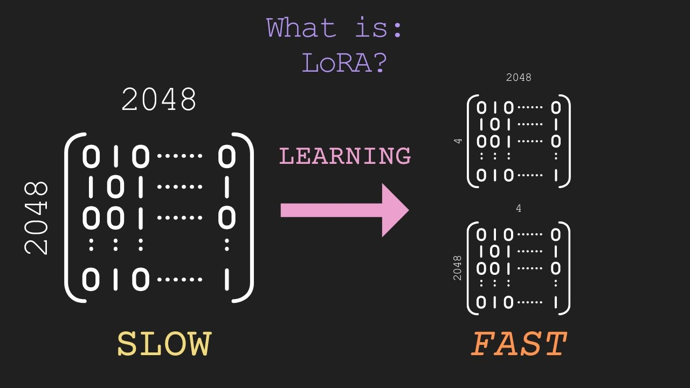
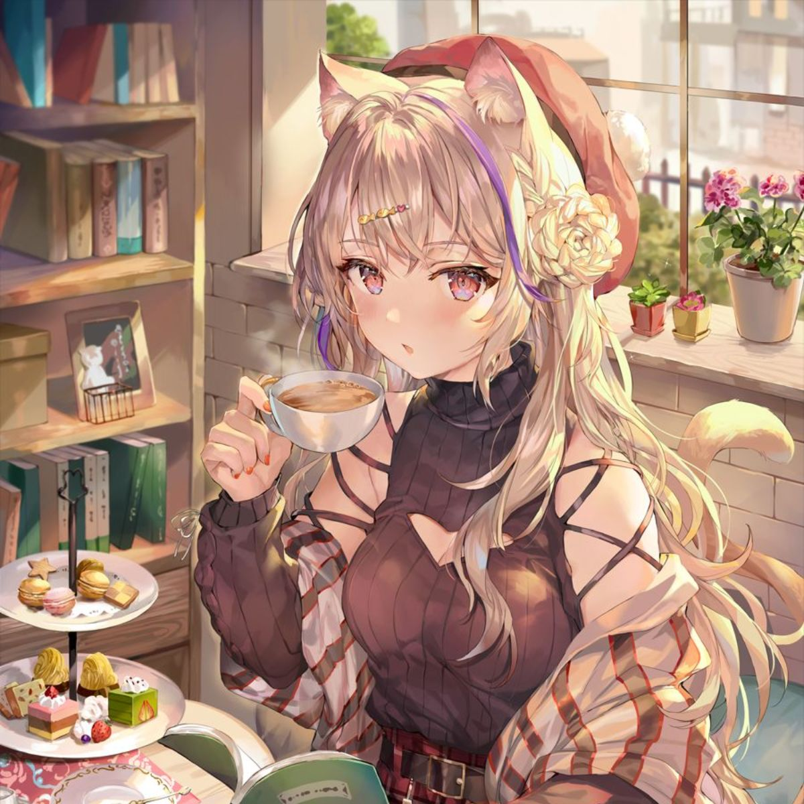

# LoRA

<p align="center">
[Youtube_Link](https://youtu.be/dA-NhCtrrVE?si=xhoLto3eRSF3g7ec)


## Install Requirements
```
git clone https://github.com/ugiugi0823/LoRA.git
```

### By conda
```
conda env create -f environment.yaml
conda activate nd
```
### OR by pip
```
pip install -r requirements.txt
```


## Download model and data
### model weight
```
cd SD-models
wget https://huggingface.co/runwayml/stable-diffusion-v1-5/resolve/main/v1-5-pruned-emaonly.ckpt?download=true
```
### dataset
```
wget -O mmk.tgz https://pub-2fdef7a2969f43289c42ac5ae3412fd4.r2.dev/mmk.tgz
tar -C <your home dir>/LoRA/dataset -zxvf mmk.tgz
sed -i 's|img_path:.*|img_path: <your home dir>/LoRA/dataset|' <your home dir>/LoRA/train.yaml
```


## Experiments

Train [LoRA](https://arxiv.org/abs/2106.09685)

```bash
python trainer.py --config experiment/lora.yaml

## extract 
python experiment/extract_lora.py --src ./checkpoint/last.ckpt --dst ./lora/last.ckpt
```

Train [LoCon](https://github.com/KohakuBlueleaf/LoCon)

```bash
python trainer.py --config experiment/locon.yaml

## extract 
python experiment/extract_lora.py --src last.ckpt
```

Train [Textual Inversion](https://textual-inversion.github.io)

```bash
python trainer.py --config experiment/textual_inversion.yaml
```

Convert any checkpoint to safetensors
```bash
python scripts/sd_to_safetensors.py --src input.ckpt --dst output.safetensors
```


## Result


|book, cup, teacup, plate, flower, bookshelf, animal_ears, 1girl, ribbed_sweater, open_book, tea, rose, potted_plant, sweater, food, table, cake, long_hair, cake_slice, saucer, hair_ornament, off_shoulder, menu, tail, pink_rose, solo, cat_ears, brown_hair, red_nails, plant, cookie, coffee, hat, pink_flower, holding_book, mug, tiered_tray, purple_flower, fork, nail_polish, red_headwear, sandwich, teapot, cat_tail, chair, pancake, indoors, looking_at_viewer, white_flower, sitting|autumn_leaves, maple_leaf, leaf, autumn, falling_leaves, holding_leaf, bell, jingle_bell, japanese_clothes, 1girl, blue_sky, day, sky, leaf_hair_ornament, cloud, ginkgo_leaf, miko, outdoors, shrine, solo, leaves_in_wind, white_kimono, tree, hakama_skirt, smile, looking_at_viewer, hakama, long_hair, cloudy_sky, brown_hair, hair_ornament, building, long_sleeves, brown_eyes, architecture, skirt, leaf_print|
|--|--|
|||


## Special appreciation
https://github.com/Mikubill/naifu-diffusion


